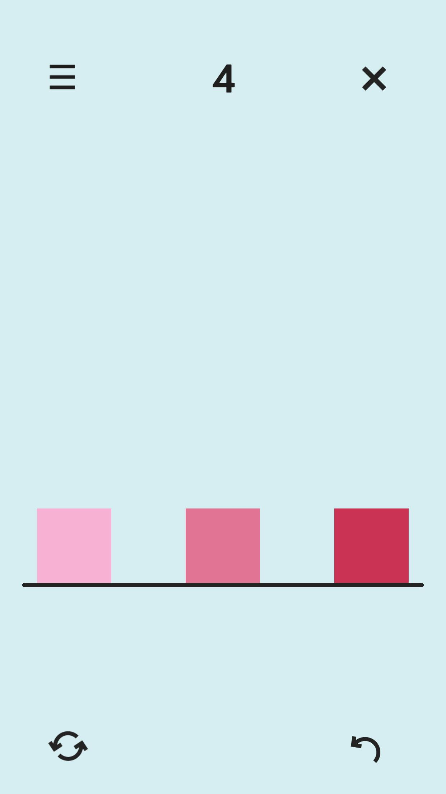
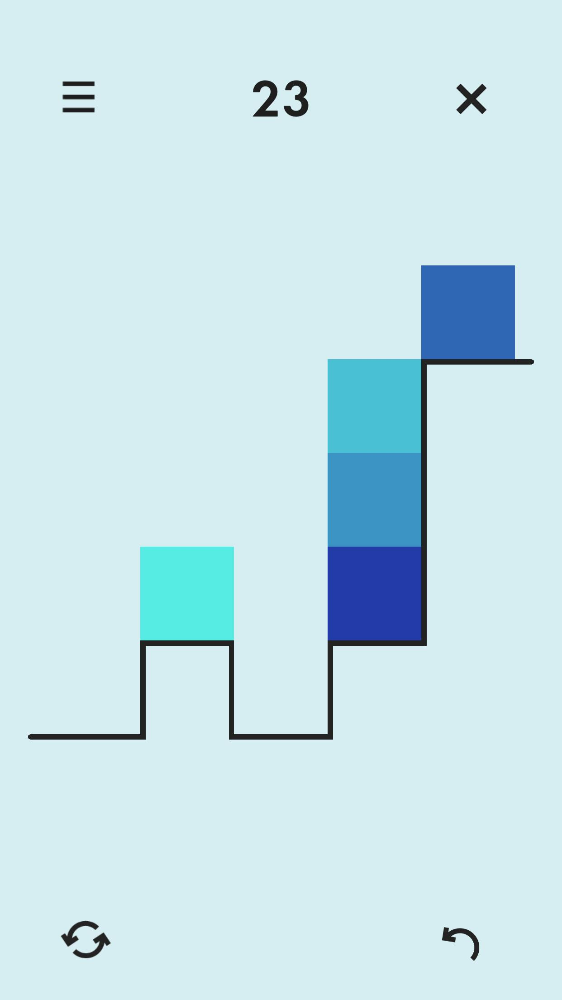
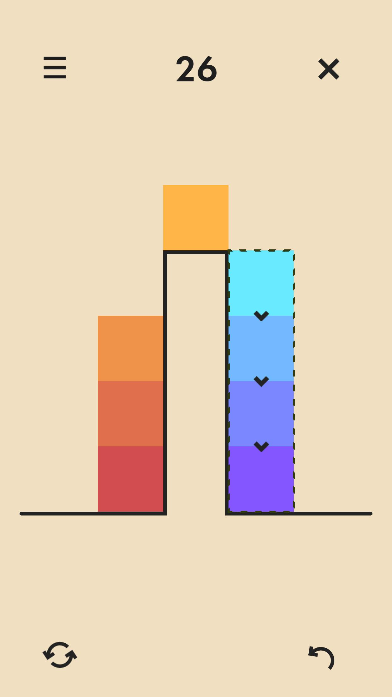
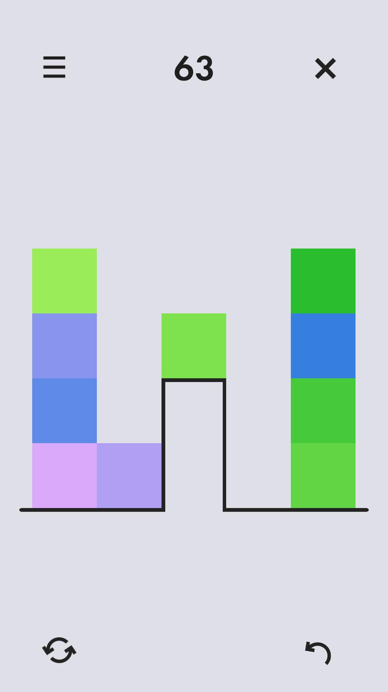
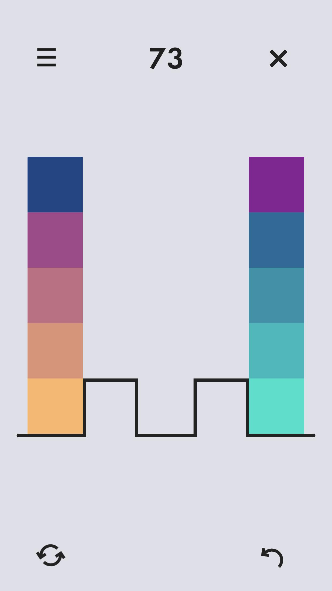
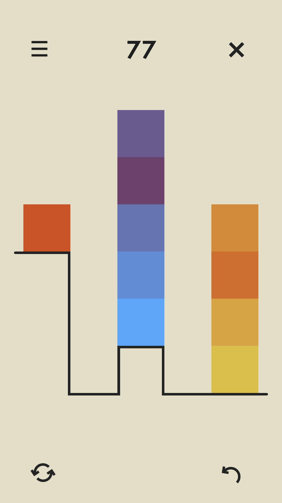
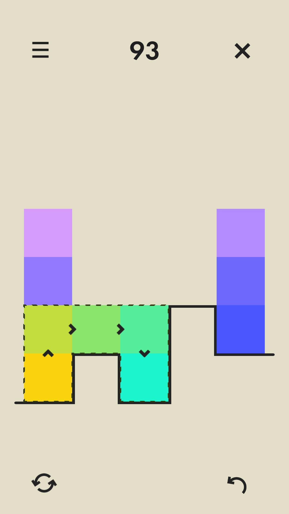
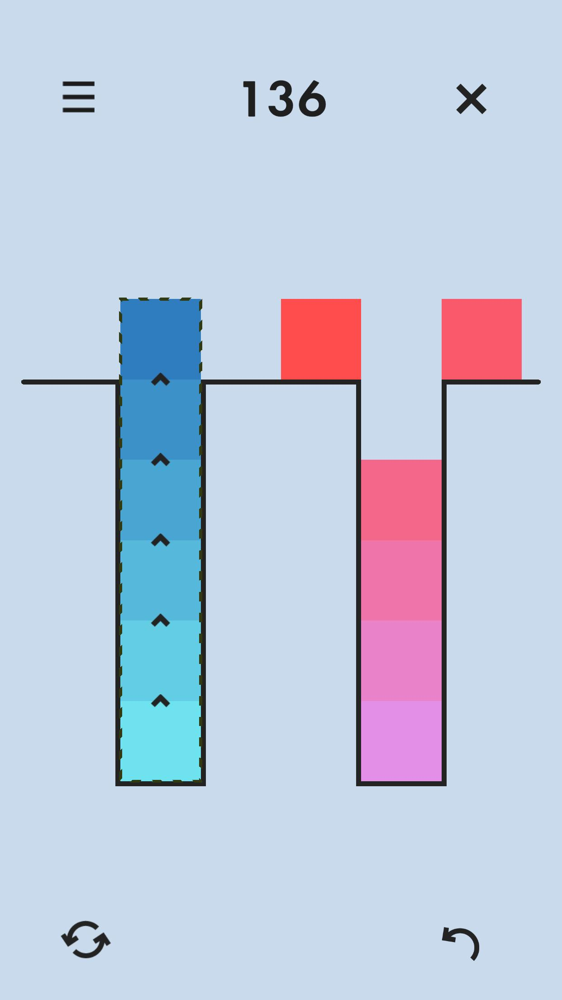

# Gradient Blocks
A beautiful, relaxing color puzzle that will test your perception and logic skills.

## Factsheet:
 - Developer: Jose Contreras
 - Release date: June 11th 2024
 - Platforms: Android/iOS
 - Price: Free (includes IAP to remove ads)

## Description

Test your color perception and logic skills throughout 150 elegantly handcrafted levels with unique and soothing palettes. No timers, no move counts or ratings for completing a level certain way, just gradients for you to arrange and enjoy. 

Don't be fooled by its cute looks though, behind the apparent simplicity hides a tricky game! Those who enjoy a challenge will certainly be delighted by the subtle intrincacies and perceptive nuances that arise as you progress through the game.

Features:

* Unique combination of logic and color-based gameplay
* Clean, minimal, slick design - each level is a tiny work of art
* Soft and soothing custom made soundtrack
* Fully offline gameplay - no internet needed

## Video Trailer

<iframe width="560" height="315" src="https://www.youtube.com/embed/L71Tqh7m-tU?si=pYmpTxH4ARlNqXAy" title="YouTube video player" frameborder="0" allow="accelerometer; autoplay; clipboard-write; encrypted-media; gyroscope; picture-in-picture; web-share" referrerpolicy="strict-origin-when-cross-origin" allowfullscreen></iframe>

## Images

Download all images as a compressed file: [Download images link](https://drive.google.com/file/d/1i5zyFAJZjZXpNb2_UGz400cnAhWW0npK/view?usp=sharing)

  
  
  
  

  
   
  
  

